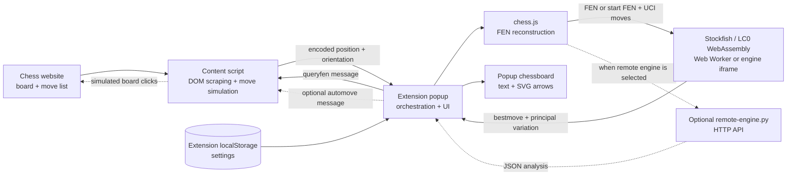
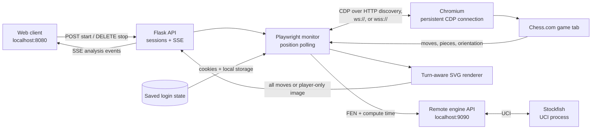

# Mephisto Relay

**Remote live chess analysis for mobile devices, secondary screens, and other connected clients.**

Mephisto Relay monitors an authenticated live game in a dedicated remote browser, analyzes each new position
with Stockfish, and streams turn-aware move text and annotated board images to a lightweight web client. The
analysis client can run anywhere that can reach the server, including a phone, tablet, or another computer.

Chess.com monitoring is supported today. Lichess support is planned. The monitoring and client layers are kept
separate from site discovery so future inputs—such as resolving a live game from a player name—can feed the same
analysis pipeline.

This project is derived from and reuses parts of the
[original Mephisto browser extension](https://github.com/AlexPetrusca/Mephisto), but has a different purpose and
runtime architecture.

## How the Original Browser Extension Works

The original Mephisto application is a Manifest V3 browser extension. Its analysis loop is split between a
content script running inside the chess website and the extension popup opened from the browser toolbar. There
is no central application server in the original local-engine flow.



### Extension components

- `manifest.json` registers the toolbar popup, the Manifest V3 background service worker, and content scripts for
  Chess.com, Lichess, and BlitzTactics. Content scripts load automatically on matching pages; clicking the
  extension icon is not required for DOM access.
- `src/scripts/content-script.js` understands each supported site's board DOM. It reads pieces, move records,
  board orientation, side to move, last-move highlights, promotions, and non-standard starting positions.
- `src/popup/popup.js` owns the active analysis loop, engine process, reconstructed chess position, popup board,
  arrows, evaluation text, and toolbar actions.
- `lib/chess.js` validates SAN moves and reconstructs complete FEN positions from the scraped move history.
- `lib/engine/` contains the bundled Stockfish, Fairy-Stockfish, and LC0 JavaScript/WebAssembly engines and neural
  network weights.
- `src/scripts/remote-engine.py` is an optional Python/UCI alternative to the engines bundled in the extension.
- `src/scripts/background-script.js` is a small service worker used for legacy page-action handling. It is not the
  main analysis coordinator; the popup performs that role.
- `src/options/` stores engine, timing, variant, autoplay, and appearance settings in extension `localStorage`.

### Position polling and reconstruction

When the popup opens, it loads settings, creates the display chessboard, initializes a small FEN cache, and starts
the selected engine. It then sends a `queryfen` message to the active browser tab every `fen_refresh` milliseconds
(100 ms by default).

The content script answers by scraping the current page and returning two values:

- a compact encoded position string;
- the board orientation (`white` or `black`).

The encoded string begins with metadata identifying the website and representation. For example, Chess.com
positions use the `cc` site tag, while `fen`, `puz`, and `var` distinguish move-history positions, piece-list
positions, and variant games. Standard games normally send SAN move records. Puzzle-like pages without a normal
move list send each piece's color, type, and square instead.

The popup converts that response into a real chess position:

1. If the complete encoded position is cached, its FEN is reused directly.
2. If only one move was appended, the cached previous FEN is loaded and the newest SAN move is applied.
3. Otherwise, `chess.js` replays the entire SAN history from the standard or detected starting position.
4. For a piece-list response, the popup clears a board, places every scraped piece, and sets the detected turn.

This cache avoids replaying the full game on every 100 ms poll. Analysis only restarts when the resulting FEN
differs from the last evaluated FEN.

### Engine analysis

For a bundled engine, the popup sends standard UCI commands:

```text
stop
position fen <current-fen>
go movetime <configured-compute-time>
```

For Chess960 or other variants it can instead send a starting FEN followed by the reconstructed UCI move list.
Engine settings such as hash size, threads, MultiPV, variant, and NNUE weights are configured during popup
initialization.

During analysis, `info depth ... pv ...` messages continuously update the evaluation and principal variations.
The first principal-variation move is displayed as the best move, and the second move is displayed as the best
response. The final `bestmove` message marks analysis as complete. When the remote engine is selected, the popup
sends the same position to `POST /analyse` and consumes an equivalent JSON result.

### Popup rendering

The popup uses the bundled chessboard library and piece assets to show the reconstructed position. Its orientation
follows the website board. The primary recommendation is drawn as a blue SVG arrow and the expected reply as a
red arrow. Depending on settings, it can also show evaluation score, search depth, multiple candidate arrows,
threat analysis, coordinates, and different piece or board themes.

The normal text output is turn-based:

```text
White to play, best move is <move>
Best response for Black is <response>
```

The labels reverse when Black is to move. This original output is based on the actual side to move and is not
tied to a separately supplied player color.

### Optional move automation

When autoplay is enabled and the recommended side matches the website board orientation, the popup sends an
`automove` message back to the content script. The content script converts UCI squares into board coordinates,
waits for configured randomized think and movement delays, and simulates the source, destination, and optional
promotion clicks. Puzzle mode can follow a longer principal variation and wait for the website's response between
moves.

The normal automation path dispatches browser mouse events through the extension debugger permission. The
optional legacy Python clicker provides a separate OS-level click backend.

### Original lifecycle limitation

The content script starts automatically, but the popup contains the engine and polling timer. Browser popups are
destroyed when they close, so analysis stops when the user dismisses the popup. The popup also queries only the
currently active tab. These constraints are why the live monitoring server below moves orchestration into a
long-running process with a persistent browser connection, dedicated game tabs, and SSE updates to an independent
client UI.

## Live Game Monitoring Server

The repository includes a standalone web client and monitoring server for following an authenticated Chess.com
game without opening the extension popup. The client submits a game ID or URL and the player's color. The server
opens that game in a dedicated Playwright tab and streams updated analysis to the client until monitoring is
stopped.

The browser extension is optional for this flow. The server injects the same Chess.com DOM adapter used by the
extension, while the existing Python remote-engine server remains responsible for Stockfish analysis.

### Architecture



### How a monitoring session works

1. The client sends `gameId` and `color` to `POST /api/sessions`.
2. The server normalizes IDs and supported Chess.com URLs into `https://www.chess.com/game/<gameId>` and derives
   the opponent's color.
3. The Playwright connection manager attaches to the Chromium CDP endpoint started by `launch_browser.py`.
   The application never starts or replaces the browser itself.
4. The saved Chess.com storage state is loaded into a browser context, and the game opens in a new tab.
5. The shared DOM adapter reads the move list, pieces, board orientation, and animation state. The server rebuilds
   the position from SAN moves, with a piece-position fallback when necessary.
6. Only a changed FEN triggers a Stockfish request. The top principal-variation move is the current side's best
   move; the second move is the other side's best response.
7. The server creates player-oriented SVGs and publishes an `analysis` event over SSE. The client updates its text
   and image without polling the API.
8. Stopping the session closes its SSE stream and Playwright tab. The shared browser connection remains active.

Turn ownership is explicit in every analysis. On the player's turn the UI shows **Your best move** followed by
**Opponent's best response**. On the opponent's turn it shows **Opponent to move — best move** followed by
**Your best response**.

The optional **Only show my move** toggle is client-side and can be changed while monitoring. On the player's
turn it selects the player-only SVG and hides the response. During the opponent's turn it hides all move text and
the board image and displays a waiting state until the position changes back to the player's turn.

### Installation

Python 3.11 or newer and a Stockfish executable are required.

```bash
python3 -m venv server/.venv
source server/.venv/bin/activate
pip install -r server/requirements.txt
playwright install chromium
```

On macOS with Homebrew, Stockfish can be installed with `brew install stockfish`.

### Launch the persistent browser

Start the dedicated local Chromium instance from the repository root:

```bash
PLAYWRIGHT_CDP_URL=http://127.0.0.1:9222 \
python server/scripts/launch_browser.py
```

The command is idempotent: it checks the CDP health endpoint first and does not launch another browser when one
is already listening. The browser uses `server/.auth/chromium-profile/` and remains running for the login helper
and monitoring server.

For a remote browser, skip this command and provide the existing CDP `ws://` or `wss://` URL to the other
processes.

### One-time Chess.com login

Run the login helper from the repository root:

```bash
PLAYWRIGHT_CDP_URL=http://127.0.0.1:9222 \
python server/scripts/first_login.py
```

The browser must already be running. The helper connects to it and opens Chess.com login in a new tab. Complete
login, including any verification challenge, then return to the terminal and press Enter only after the Chess.com
home page is visible.

The helper writes:

- `server/.auth/chesscom-storage-state.json` — cookies and local storage loaded by Playwright;
- `server/.auth/chromium-profile/` — the persistent local browser profile.

Both paths are ignored by Git. The storage-state file has owner-only permissions and contains authenticated
session material; do not share or commit it.

For a remote browser, provide its existing CDP `ws://` or `wss://` URL.

### Start the services

Start the engine API in the first terminal:

```bash
source server/.venv/bin/activate
python src/scripts/remote-engine.py "$(which stockfish)" \
  --option Hash:32 \
  --option Threads:2 \
  --port 9090
```

Check that Stockfish is available:

```bash
curl http://127.0.0.1:9090/health
```

The expected response is `{"status":"ok"}`. If the Stockfish child exits later, the next analysis request restarts
it and retries once.

Start the web and monitoring server in a second terminal:

```bash
source server/.venv/bin/activate
PLAYWRIGHT_CDP_URL=http://127.0.0.1:9222 \
MEPHISTO_ENGINE_URL=http://127.0.0.1:9090 \
python -m server.app
```

A successful connection ends with logs similar to:

```text
Loading Chess.com login state from .../server/.auth/chesscom-storage-state.json
Playwright CDP connection established
```

Open [http://127.0.0.1:8080](http://127.0.0.1:8080), enter a game ID or Chess.com game URL, select your color,
and click **Start monitoring**.

### HTTP and SSE API

| Method   | Endpoint                               | Purpose                                              |
| -------- | -------------------------------------- | ---------------------------------------------------- | -------- |
| `POST`   | `/api/sessions`                        | Start a session with `{"gameId":"...","color":"white | black"}` |
| `GET`    | `/api/sessions/<id>/events`            | Receive named SSE events and 15-second heartbeats    |
| `GET`    | `/api/sessions/<id>/latest.svg`        | Current board with the best move and response        |
| `GET`    | `/api/sessions/<id>/latest-player.svg` | Current board with only the player's move            |
| `DELETE` | `/api/sessions/<id>`                   | Stop monitoring and close the game tab               |
| `GET`    | `http://127.0.0.1:9090/health`         | Check the remote Stockfish process                   |

The primary SSE event types are `connecting`, `monitoring`, `analysis`, `analysis-error`, `reconnecting`, and
`stopped`. An `analysis` payload includes turn ownership, both UCI moves, FEN, evaluation data, and URLs for both
SVG variants. `EventSource` reconnects automatically if the HTTP stream is interrupted.

### Configuration

| Variable                   | Default                                    | Purpose                                                   |
| -------------------------- | ------------------------------------------ | --------------------------------------------------------- |
| `PLAYWRIGHT_CDP_URL`       | `http://127.0.0.1:9222`                    | Local discovery URL or full `ws://`/`wss://` CDP endpoint |
| `MEPHISTO_ENGINE_URL`      | `http://127.0.0.1:9090`                    | Existing remote engine base URL                           |
| `MEPHISTO_STORAGE_STATE`   | `server/.auth/chesscom-storage-state.json` | Saved Chess.com cookies and local storage                 |
| `MEPHISTO_BROWSER_PROFILE` | `server/.auth/chromium-profile`            | Persistent profile used by `launch_browser.py`            |
| `MEPHISTO_COMPUTE_TIME_MS` | `1500`                                     | Analysis time for each new position                       |
| `MEPHISTO_POLL_INTERVAL`   | `0.25`                                     | Chess.com position polling interval in seconds            |
| `MEPHISTO_PORT`            | `8080`                                     | Web client and API port                                   |
| `MEPHISTO_LOG_LEVEL`       | `DEBUG`                                    | Server log verbosity                                      |

Set `MEPHISTO_LOG_LEVEL=INFO` after integration is stable. DEBUG logs include CDP connection attempts, session
events, FEN analysis requests, engine retries, and cleanup.

### Troubleshooting

- **`ECONNREFUSED 127.0.0.1:9222`**: install the bundled browser with `playwright install chromium`, then run
  `python server/scripts/launch_browser.py`. `server.app` is connect-only by default.
- **Chess.com redirects to login**: rerun `server/scripts/first_login.py`, finish login, and restart `server.app`
  so it reloads the storage-state file.
- **`engine request failed`**: check `curl http://127.0.0.1:9090/health`. Restart an older engine process once so
  it loads the current automatic-recovery implementation.
- **Port 8080 is already used**: set `MEPHISTO_PORT` to another port. The optional legacy clicker also defaults
  to 8080 and cannot run there simultaneously.
- **Remote WSS cannot connect**: confirm that the URL is a Chromium CDP endpoint, not a Playwright browser-server
  WebSocket endpoint.

### Tests

```bash
source server/.venv/bin/activate
python -m unittest discover -s server/tests -v
```

## Contributing to Mephisto Relay

Contributions should support the project's remote-monitoring purpose rather than extend the original toolbar
popup. Useful areas include:

- Lichess monitoring through a site-specific DOM adapter;
- resolving an active game from a player name instead of a supplied game ID;
- mobile and small-screen client improvements;
- browser-session cleanup and resource reduction;
- additional engine configuration and analysis metadata;
- resilient SSE reconnection and multi-client session behavior;
- captured DOM fixtures and regression tests for website markup changes; and
- setup, deployment, and troubleshooting documentation.

### Development workflow

1. Create the Python environment and install dependencies using the installation steps above.
2. Make the smallest change that solves one clearly defined problem.
3. Add or update tests under `server/tests/` for server-side behavior.
4. Run the complete test suite:

   ```bash
   source server/.venv/bin/activate
   python -m unittest discover -s server/tests -v
   ```

5. For monitoring changes, test both White and Black player colors, both sides to move, normal and player-only
   display modes, SSE stop/reconnect behavior, and browser-tab cleanup.
6. Describe any manual Chess.com verification performed and include sanitized logs when reporting failures.

### Architecture guidelines

- Keep game discovery separate from monitoring. New inputs should resolve to the existing normalized game target:
  game ID, canonical URL, player color, and opponent color.
- Keep website-specific selectors and scraping behavior in adapters. Do not spread Chess.com or future Lichess DOM
  details across the session, engine, or client layers.
- Preserve the SSE contract when possible. Add fields compatibly instead of changing the meaning of existing
  turn, move-owner, or image fields.
- Keep Stockfish behind the engine API so browser monitoring and analysis remain independently replaceable.
- Prefer deterministic unit tests and captured position data over tests that require a live game.
- Do not add automated credential entry or bypass login verification. Authentication remains an explicit manual
  setup step.

### Security and pull-request checklist

Never commit files from `server/.auth/`, browser profiles, storage-state JSON, cookies, account details, or
unsanitized logs containing authenticated URLs or tokens.

Before submitting a change, confirm that:

- the full test suite passes;
- temporary DEBUG logging and diagnostic code have been removed or intentionally documented;
- no authentication state or generated browser data is included;
- README commands and configuration tables still match the implementation; and
- the change remains focused on remote live analysis for connected clients.
