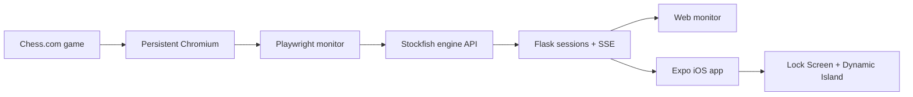

<p align="center">
  
</p>

<h1 align="center">Mephisto Relay</h1>

<p align="center">
  Live, turn-aware Stockfish analysis on the web, iPhone, Lock Screen, and Dynamic Island.
</p>

<p align="center">
  <a href="server/README.md">Relay server</a> ·
  <a href="mobile/README.md">iOS client</a> ·
  <a href="src/README.md">Browser extension</a> ·
  <a href="LICENSE">License</a>
</p>

Mephisto Relay watches an authenticated Chess.com game in a dedicated Chromium session, reconstructs each new
position, analyzes it with Stockfish, and streams the result to connected clients. Recommendations are labeled
from the selected player's perspective, with a blue best-move arrow and red expected-response arrow.

> [!NOTE]
> This project is intended for personal development and analysis. Follow the rules of the chess platform and
> event in which you use it.

## See it in action

<table align="center">
  <tr>
    <td width="33%" align="center"><strong>Relay setup</strong></td>
    <td width="33%" align="center"><strong>Native iOS analysis</strong></td>
    <td width="33%" align="center"><strong>Dynamic Island</strong></td>
  </tr>
  <tr>
    <td align="center"></td>
    <td align="center"></td>
    <td align="center"></td>
  </tr>
</table>

<p align="center">
  
</p>

## Highlights

- Dedicated Playwright/Chromium monitoring session with reusable Chess.com login state.
- Stockfish analysis through the bundled Python remote-engine API.
- Named Server-Sent Events with reconnection, heartbeats, and latest-state recovery.
- Responsive web monitor with versioned, self-contained SVG boards.
- Expo iOS client with native piece assets, smooth updates, player-only mode, and session refresh.
- ActivityKit Live Activity for the Lock Screen and Dynamic Island.
- Original Manifest V3 browser-extension implementation retained for reference and standalone use.

## Architecture



## Quick start

Requirements: Python 3.11+, Node.js, Playwright Chromium, and Stockfish.

```bash
python3 -m venv server/.venv
source server/.venv/bin/activate
pip install -r server/requirements.txt
playwright install chromium
```

Run these commands in separate terminals from the repository root:

```bash
# 1. Persistent browser (log in once with server/scripts/first_login.py)
python server/scripts/launch_browser.py

# 2. Stockfish HTTP service
python src/scripts/remote-engine.py "$(which stockfish)" --port 9090

# 3. Relay and web monitor
MEPHISTO_HOST=0.0.0.0 python -m server.app
```

Open [http://127.0.0.1:8080](http://127.0.0.1:8080), or start the iOS development build:

```bash
cd mobile
pnpm install
pnpm ios
```

The iPhone must use the Mac's LAN address, such as `http://192.168.1.20:8080`, rather than `127.0.0.1`.

## Documentation

| Component         | Documentation                        | Purpose                                                           |
| ----------------- | ------------------------------------ | ----------------------------------------------------------------- |
| Relay and web UI  | [server/README.md](server/README.md) | Authentication, services, API, configuration, and troubleshooting |
| iOS application   | [mobile/README.md](mobile/README.md) | Device builds, LAN setup, Live Activities, and validation         |
| Browser extension | [src/README.md](src/README.md)       | Original extension architecture, engines, and optional automation |

## Tests

```bash
server/.venv/bin/python -m unittest discover -s server/tests -v

cd mobile
pnpm typecheck
pnpm test
```

Authenticated browser state under `server/.auth/` is private and ignored by Git. Never commit cookies, storage
state, account information, or unsanitized authenticated URLs.

Mephisto Relay is derived from and reuses parts of the
[original Mephisto browser extension](https://github.com/AlexPetrusca/Mephisto).
