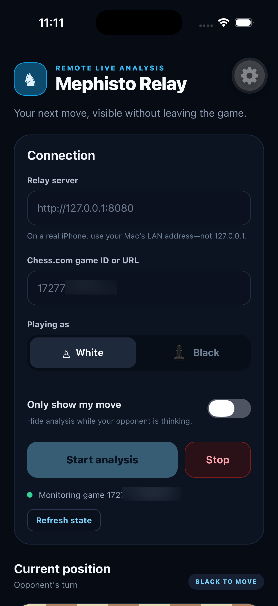
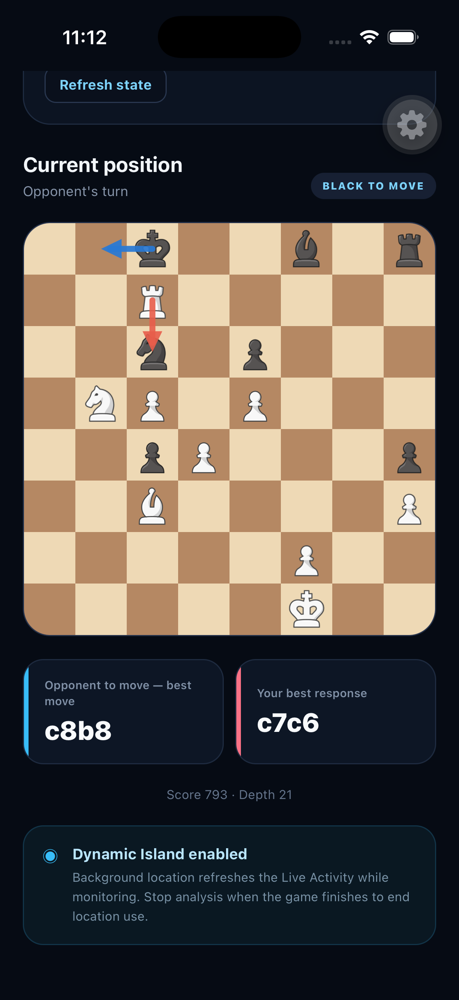
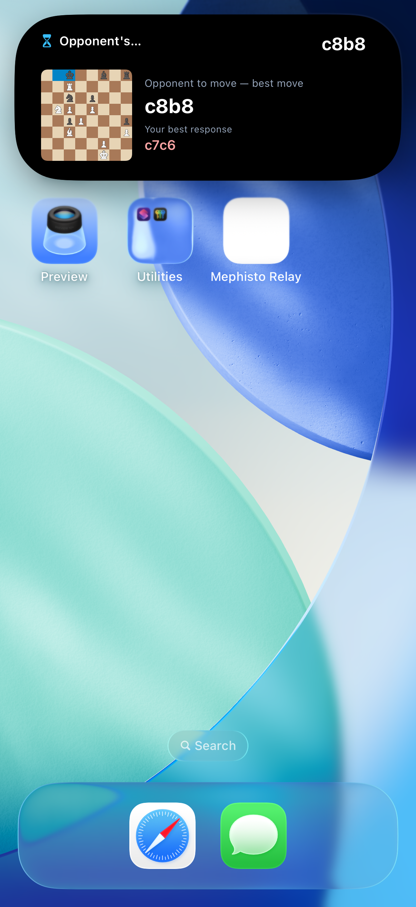

# Mephisto Relay for iOS

The Expo SDK 57 client controls relay sessions, consumes live analysis over SSE, renders the board with bundled
native PNG assets, and maintains an ActivityKit Live Activity for the Lock Screen and Dynamic Island.

<div align="center">
<table style="width: 100%; table-layout: fixed;">
  <tr>
    <td style="padding: 10px;"></td>
    <td style="padding: 10px;"></td>
    <td style="padding: 10px;"></td>
  </tr>
</table>
</div>

## Requirements

- Node.js 22.13 or newer and pnpm
- Xcode 26.4 or newer with a compatible iOS platform
- CocoaPods 1.16.2 or newer
- iOS 16.4 or newer
- A physical Dynamic Island-capable iPhone for final Dynamic Island testing

Expo Go is not supported because Live Activities, widget assets, and background location require generated native
targets. Use an Expo development build.

## Configure the relay

The phone cannot reach the Mac through `127.0.0.1`. Start Flask on the LAN interface:

```bash
PLAYWRIGHT_CDP_URL=http://127.0.0.1:9222 \
MEPHISTO_ENGINE_URL=http://127.0.0.1:9090 \
MEPHISTO_HOST=0.0.0.0 \
python -m server.app
```

Find the Mac's Wi-Fi address with `ipconfig getifaddr en0`, then enter `http://<mac-ip>:8080` in the app. The
phone and Mac must be on the same network. Plain HTTP is permitted for this trusted-LAN development build; use
HTTPS before exposing the relay elsewhere.

## Install and run

```bash
cd mobile
pnpm install
pnpm ios
```

`expo run:ios` performs the native build. To regenerate explicitly or use Xcode:

```bash
pnpm prebuild
open ios/MephistoRelay.xcworkspace
```

Always open the workspace, not the `.xcodeproj`. Before signing for a physical device, replace the application,
widget, and App Group identifiers in `app.json` with values associated with your Apple account.

If Xcode cannot find a destination, install the required iOS platform under **Xcode → Settings → Components**
and select an available simulator or connected device.

## Runtime behavior

1. Enter the relay URL, Chess.com game ID or URL, player color, and optional player-only mode.
2. **Start analysis** creates the relay session, Live Activity, SSE stream, and background refresh task.
3. Foreground SSE events immediately update the board, move cards, and Live Activity.
4. Background location callbacks fetch `/api/sessions/<id>/latest` and refresh the Live Activity locally.
5. **Refresh state** restores or clears saved session state when the server and app disagree.
6. **Stop** closes SSE, ends the Live Activity, stops background location, and closes the server game tab.

The app uses `react-native-sse` with no stream-lifetime timeout; the server's heartbeat keeps a healthy connection
open. Board pieces are bundled locally, so turn updates do not depend on remote image loading.

## Dynamic Island and background behavior

The widget extension contains its own chess-piece asset catalog, generated by
`plugins/with-widget-chess-assets.cjs`. The app enables ActivityKit frequent updates and requests
navigation-style background location delivery every two seconds while monitoring.

Local background refresh remains best-effort because iOS controls process suspension and callback frequency,
especially when the device is stationary. Force-quitting the app ends updates, and continuous location use
increases battery consumption. ActivityKit push updates through APNs are the path to server-driven reliability
without depending on the app process.

After changing widget code or assets, rebuild the native application, stop the old Live Activity, and start a new
session. Existing activities continue to use the extension from the build that created them.

## Validation

```bash
pnpm typecheck
pnpm test
pnpm exec expo install --check
node node_modules/expo-widgets/scripts/build-bundle.mjs .
```
