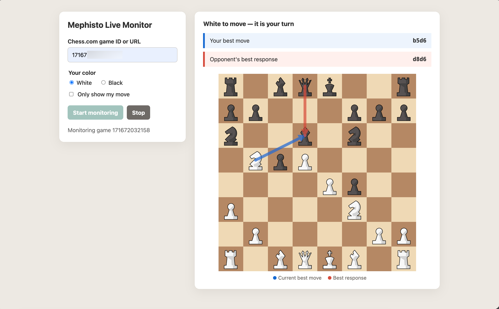

# Relay server and web monitor

The relay is a long-running Flask and Playwright service. It attaches to a persistent Chromium instance, reads
an authenticated Chess.com game, rebuilds its position, asks the Stockfish HTTP service for analysis, and
publishes named Server-Sent Events. The bundled web monitor consumes the same session API as the iOS app.



## Requirements and installation

- Python 3.11 or newer
- A Stockfish executable (`brew install stockfish` on macOS)
- Playwright Chromium

```bash
python3 -m venv server/.venv
source server/.venv/bin/activate
pip install -r server/requirements.txt
playwright install chromium
```

## Startup sequence

### 1. Launch the persistent browser

```bash
python server/scripts/launch_browser.py
```

The default Chrome DevTools Protocol (CDP) discovery endpoint is `http://127.0.0.1:9222`. The command is
idempotent and reuses `server/.auth/chromium-profile/` when the browser is already running.

For a remote browser, set `PLAYWRIGHT_CDP_URL` to its existing `ws://` or `wss://` CDP endpoint and skip the
local launcher.

### 2. Save the Chess.com login once

```bash
python server/scripts/first_login.py
```

Complete login in the opened browser, then return to the terminal. The helper saves cookies and local storage to
`server/.auth/chesscom-storage-state.json`. This file is sensitive, ignored by Git, and must not be shared.

### 3. Start Stockfish

```bash
python src/scripts/remote-engine.py "$(which stockfish)" \
  --option Hash:32 \
  --option Threads:2 \
  --port 9090
```

Verify it with `curl http://127.0.0.1:9090/health`. This process is mandatory for the relay flow because the
monitor delegates position analysis to its HTTP API.

### 4. Start the relay

```bash
PLAYWRIGHT_CDP_URL=http://127.0.0.1:9222 \
MEPHISTO_ENGINE_URL=http://127.0.0.1:9090 \
MEPHISTO_HOST=0.0.0.0 \
python -m server.app
```

Open `http://127.0.0.1:8080` locally. LAN clients use `http://<mac-ip>:8080`.

## Session lifecycle

1. `POST /api/sessions` receives a game ID or URL and the player's color.
2. Playwright opens a dedicated game tab and injects the shared Chess.com DOM adapter.
3. The monitor reconstructs FEN from SAN history, with a direct piece snapshot as fallback.
4. A changed position triggers Stockfish analysis.
5. The relay publishes the FEN, evaluation, turn ownership, best move, response, and versioned SVG URLs.
6. Stopping the session closes its event stream and game tab but leaves the persistent browser available.

The web UI can optionally show only the player's move. During the opponent's turn, this mode displays a waiting
state instead of retaining stale analysis.

## API

| Method | Endpoint | Purpose |
| --- | --- | --- |
| `POST` | `/api/sessions` | Start a session with `gameId` and `color` |
| `GET` | `/api/sessions/<id>/events` | Named SSE events and 15-second heartbeats |
| `GET` | `/api/sessions/<id>/latest` | Latest event for app restoration/background refresh |
| `GET` | `/api/sessions/<id>/latest.svg` | Versioned board with best move and response |
| `GET` | `/api/sessions/<id>/latest-player.svg` | Versioned player-only board |
| `DELETE` | `/api/sessions/<id>` | Stop the session and close its game tab |

Example request:

```json
{"gameId": "123456789", "color": "white"}
```

Event types are `connecting`, `monitoring`, `analysis`, `analysis-error`, `reconnecting`, and `stopped`.

## Configuration

| Variable | Default | Purpose |
| --- | --- | --- |
| `PLAYWRIGHT_CDP_URL` | `http://127.0.0.1:9222` | Local discovery URL or full CDP WebSocket URL |
| `MEPHISTO_ENGINE_URL` | `http://127.0.0.1:9090` | Stockfish HTTP service |
| `MEPHISTO_STORAGE_STATE` | `server/.auth/chesscom-storage-state.json` | Saved Chess.com session |
| `MEPHISTO_BROWSER_PROFILE` | `server/.auth/chromium-profile` | Persistent Chromium profile |
| `MEPHISTO_COMPUTE_TIME_MS` | `1500` | Analysis time per position |
| `MEPHISTO_POLL_INTERVAL` | `0.25` | Board polling interval in seconds |
| `MEPHISTO_HOST` | `127.0.0.1` | Bind address; use `0.0.0.0` for LAN access |
| `MEPHISTO_PORT` | `8080` | Web and API port |
| `MEPHISTO_LOG_LEVEL` | `DEBUG` | Server log verbosity |

## Troubleshooting

- **CDP connection refused:** run `playwright install chromium`, then `server/scripts/launch_browser.py`.
- **Redirected to login:** rerun `server/scripts/first_login.py` and restart the relay.
- **Engine request failed:** check `curl http://127.0.0.1:9090/health` and restart the engine process.
- **Phone cannot connect:** bind to `0.0.0.0`, use the Mac's LAN IP, and allow Python through the macOS firewall.
- **Port already used:** change `MEPHISTO_PORT`; the legacy clicker also defaults to port 8080.

## Tests

```bash
server/.venv/bin/python -m unittest discover -s server/tests -v
```
